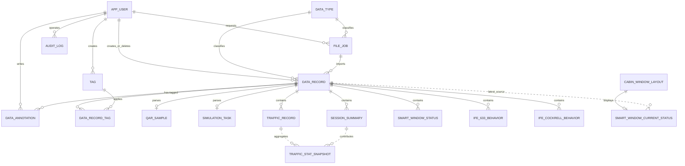

# 前中后舱网联数据显示平台数据库建表文档（首期 18 表方案）

## 1. 文档目标

本文档定义“数据管理 + 七类模拟器数据结构化入库 + 流量统计 + 智慧舷窗展示”所需的 PostgreSQL Schema。首期建立 8 张公共管理表、7 张模拟器业务表和 3 张展示派生表，共 18 张表。每份 UDP 报文完整保存到 `data_record.raw_payload`，同时把可查询的业务字段解析到对应业务表；流量和舷窗页面使用派生表保存聚合或最新状态快照。

本方案支持：

- 管理员登录。
- 7 路 UDP 数据接收及结构化明细入库。
- 数据列表、筛选、分页、排序和原始报文详情。
- 标签、批注、软删除、恢复和审计。
- 流量统计页面的任务、应用、终端和时间窗口聚合。
- 智慧舷窗页面的布局映射与最新状态展示。
- CSV 导入、CSV/PDF 导出及任务历史。
- 7+7 天数据保留策略。

首期页面交付数据管理、流量统计和智慧舷窗展示；7 张业务表用于保证模拟数据字段有明确类型、约束和查询入口，3 张展示派生表只服务已确认的流量统计和舷窗展示，不代表首期开发轨迹、完整乘客实时动态、乘客画像或推荐。

## 2. 技术和命名约定

| 项 | 约定 |
| --- | --- |
| 数据库 | PostgreSQL 18 |
| 数据库名 | `cabin_data_platform` |
| 应用用户 | `cabin_app` |
| Schema | `public` |
| 迁移工具 | Flyway |
| 主键 | UUID；审计流水使用 `bigint identity` |
| 时间 | `timestamptz`，前端按 `Asia/Shanghai` 展示 |
| JSON | 合法报文保存为 `jsonb`，非法 JSON 保存原始文本 |
| 命名 | 表名、字段名、索引名均使用小写 snake_case |
| 部署 | Docker Compose + PostgreSQL 18 官方镜像 |

数据库密码、管理员初始密码和 JWT 密钥必须由 `.env` 或运行环境注入，不得写入迁移 SQL。

## 3. 建模原则

1. 一份 UDP 数据报对应一条 `data_record`。
2. 流量、会话、舷窗和 IFE 报文中的 `items` 按业务项拆入对应明细表；原始批量报文仍只在 `data_record` 保存一份。
3. 飞机、航班和来源设备暂不建主表，直接把当前数据管理筛选需要的字段保存到 `data_record`。
4. 原始报文写入后禁止更新；只允许修改管理字段、标签和批注。
5. 数据类型使用字典表，不使用 PostgreSQL enum，后续增加类型不需要修改列类型。
6. 导入和导出合并为 `file_job`，通过 `job_type` 区分。
7. 标签采用标准多对多结构，不使用字符串拼接或 JSON 数组。
8. 审计日志只追加，不允许应用账号修改或删除。
9. 流量统计快照从 `traffic_record` 和 `session_summary` 派生，可重算，不替代原始业务明细。
10. 智慧舷窗当前状态从 `smart_window_status` 派生，保留最新展示状态；原始舷窗报文仍以 `data_record + smart_window_status` 为追溯基准。

## 4. 表清单和关系

首期扩展后建立 18 张表：

| 序号 | 表名 | 用途 |
| ---: | --- | --- |
| 1 | `app_user` | 管理员登录与操作人 |
| 2 | `data_type` | 七类模拟器数据配置 |
| 3 | `file_job` | 导入、导出任务及文件历史 |
| 4 | `data_record` | 所有 UDP/CSV 数据的统一目录与原始报文 |
| 5 | `tag` | 标签定义 |
| 6 | `data_record_tag` | 数据与标签多对多关系 |
| 7 | `data_annotation` | 数据批注 |
| 8 | `audit_log` | 操作审计 |
| 9 | `qar_sample` | QAR 飞行状态采样 |
| 10 | `simulation_task` | 仿真任务状态快照 |
| 11 | `traffic_record` | 终端流量窗口明细 |
| 12 | `session_summary` | 终端会话摘要快照 |
| 13 | `smart_window_status` | 智能舷窗状态明细 |
| 14 | `ife_633_behavior` | 633 IFE 乘客行为 |
| 15 | `ife_cockrell_behavior` | 科克瑞尔 IFE 乘客行为 |
| 16 | `traffic_stat_snapshot` | 流量统计聚合快照 |
| 17 | `cabin_window_layout` | 智慧舷窗静态布局 |
| 18 | `smart_window_current_status` | 智慧舷窗最新状态 |



## 5. 字段字典

### 5.1 `app_user`

首期只有管理员，不建立角色表和用户角色关系表。

| 字段 | PostgreSQL 类型 | 约束/默认值 | 说明 |
| --- | --- | --- | --- |
| `id` | uuid | PK，默认 `gen_random_uuid()` | 用户 ID |
| `username` | varchar(64) | NOT NULL | 登录名，业务层转为小写 |
| `password_hash` | varchar(255) | NOT NULL | BCrypt 密码哈希 |
| `email` | varchar(254) | NULL | 邮箱 |
| `role_code` | varchar(32) | NOT NULL，默认 `ADMIN`，CHECK=`ADMIN` | 首期固定管理员 |
| `status` | varchar(16) | NOT NULL，默认 `ACTIVE` | `ACTIVE` 或 `DISABLED` |
| `last_login_at` | timestamptz | NULL | 最近成功登录时间 |
| `version` | integer | NOT NULL，默认 1，CHECK > 0 | 乐观锁版本 |
| `created_at` | timestamptz | NOT NULL，默认 `now()` | 创建时间 |
| `updated_at` | timestamptz | NOT NULL，默认 `now()` | 修改时间 |

索引：登录名不区分大小写唯一；非空邮箱不区分大小写唯一；按状态查询。

### 5.2 `data_type`

配置七类实际 UDP 消息及默认来源映射。

| 字段 | PostgreSQL 类型 | 约束/默认值 | 说明 |
| --- | --- | --- | --- |
| `code` | varchar(64) | PK | 平台数据类型代码 |
| `name` | varchar(128) | NOT NULL | 中文名称 |
| `message_type` | varchar(128) | NOT NULL，唯一 | 模拟器消息类型 |
| `udp_port` | integer | NULL，唯一，CHECK 1–65535 | 默认监听端口 |
| `source_system_code` | varchar(64) | NOT NULL | 默认来源系统 |
| `source_device_code` | varchar(64) | NOT NULL | 默认来源设备 |
| `parser_code` | varchar(64) | NULL | 公共字段解析器编码 |
| `enabled` | boolean | NOT NULL，默认 true | 是否允许接入和筛选 |
| `supports_csv_import` | boolean | NOT NULL，默认 false | 是否提供 CSV 导入模板 |
| `supports_csv_export` | boolean | NOT NULL，默认 true | 是否允许 CSV 导出 |
| `supports_pdf_export` | boolean | NOT NULL，默认 true | 是否允许 PDF 导出 |
| `sort_order` | integer | NOT NULL，默认 0 | 页面显示顺序 |
| `description` | varchar(500) | NULL | 说明 |
| `created_at` | timestamptz | NOT NULL，默认 `now()` | 创建时间 |
| `updated_at` | timestamptz | NOT NULL，默认 `now()` | 修改时间 |

### 5.3 `file_job`

导入和导出共用一张任务表。

| 字段 | PostgreSQL 类型 | 约束/默认值 | 说明 |
| --- | --- | --- | --- |
| `id` | uuid | PK，默认 `gen_random_uuid()` | 任务 ID |
| `job_type` | varchar(16) | NOT NULL | `IMPORT` 或 `EXPORT` |
| `data_type_code` | varchar(64) | NOT NULL，FK -> `data_type.code` | 数据类型 |
| `file_format` | varchar(16) | NOT NULL | `CSV` 或 `PDF` |
| `status` | varchar(16) | NOT NULL，默认 `PENDING` | 任务状态 |
| `original_file_name` | varchar(255) | NULL | 导入时的安全原文件名 |
| `result_file_name` | varchar(255) | NULL | 导出或错误报告文件名 |
| `storage_path` | varchar(1000) | NULL | `storage/` 下相对路径 |
| `error_file_path` | varchar(1000) | NULL | 错误 CSV 相对路径 |
| `file_size` | bigint | NOT NULL，默认 0，CHECK >= 0 | 文件大小 |
| `filter_snapshot` | jsonb | NOT NULL，默认 `{}` | 导出筛选条件快照 |
| `total_rows` | integer | NOT NULL，默认 0，CHECK >= 0 | 总行数 |
| `success_rows` | integer | NOT NULL，默认 0，CHECK >= 0 | 成功行数 |
| `failed_rows` | integer | NOT NULL，默认 0，CHECK >= 0 | 失败行数 |
| `error_message` | varchar(2000) | NULL | 任务级错误摘要 |
| `idempotency_key` | varchar(128) | NULL | 防止重复提交 |
| `requested_by` | uuid | NOT NULL，FK -> `app_user.id` | 操作管理员 |
| `started_at` | timestamptz | NULL | 开始时间 |
| `completed_at` | timestamptz | NULL | 完成时间 |
| `expires_at` | timestamptz | NULL | 文件过期时间 |
| `created_at` | timestamptz | NOT NULL，默认 `now()` | 创建时间 |
| `updated_at` | timestamptz | NOT NULL，默认 `now()` | 修改时间 |

状态：`PENDING`、`RUNNING`、`SUCCEEDED`、`PARTIAL`、`FAILED`。

约束：导入只能使用 CSV；导出允许 CSV/PDF；成功数加失败数不能超过总数；终态任务必须有完成时间。

### 5.4 `data_record`

首期核心表。一份 UDP 数据报或 CSV 一行对应一条记录。

| 字段 | PostgreSQL 类型 | 约束/默认值 | 说明 |
| --- | --- | --- | --- |
| `id` | uuid | PK，默认 `gen_random_uuid()` | 平台记录 ID |
| `data_type_code` | varchar(64) | NOT NULL，FK -> `data_type.code` | 七类数据之一 |
| `ingest_method` | varchar(16) | NOT NULL | `UDP` 或 `CSV` |
| `file_job_id` | uuid | NULL，FK -> `file_job.id` | CSV 导入任务，UDP 为空 |
| `source_system_code` | varchar(64) | NOT NULL | 来源系统 |
| `source_device_code` | varchar(64) | NOT NULL | 来源设备；用于页面设备筛选 |
| `source_host` | inet | NULL | UDP 发送端 IP |
| `source_port` | integer | NULL，CHECK 1–65535 | UDP 发送端端口 |
| `aircraft_registration_no` | varchar(32) | NOT NULL | 飞机注册号，测试值 `B-TEST-001` |
| `aircraft_model` | varchar(128) | NULL | 机型 |
| `airline_code` | varchar(16) | NULL | 航司代码 |
| `flight_no` | varchar(20) | NULL | 航班号 |
| `origin` | varchar(4) | NULL | 起飞机场四字码 |
| `destination` | varchar(4) | NULL | 到达机场四字码 |
| `sent_at` | timestamptz | NOT NULL | 报文发送/业务时间 |
| `received_at` | timestamptz | NOT NULL，默认 `now()` | 平台接收/导入时间 |
| `payload_count` | integer | NOT NULL，默认 1，CHECK > 0 | 报文包含的业务项数量 |
| `raw_payload` | jsonb | NULL | 合法 JSON 原始报文，只读 |
| `raw_text` | text | NULL | JSON 解析失败时的原文，只读 |
| `parse_status` | varchar(16) | NOT NULL，默认 `RECEIVED` | 解析状态 |
| `parse_error` | text | NULL | 脱敏后的解析错误 |
| `version` | integer | NOT NULL，默认 1，CHECK > 0 | 管理字段乐观锁 |
| `is_deleted` | boolean | NOT NULL，默认 false | 软删除标志 |
| `deleted_at` | timestamptz | NULL | 删除时间 |
| `deleted_by` | uuid | NULL，FK -> `app_user.id` | 管理员删除人；系统清理可为空 |
| `delete_reason` | varchar(500) | NULL | 删除原因 |
| `created_by` | uuid | NULL，FK -> `app_user.id` | CSV 导入人；UDP 为空 |
| `created_at` | timestamptz | NOT NULL，默认 `now()` | 创建时间 |
| `updated_at` | timestamptz | NOT NULL，默认 `now()` | 修改时间 |

解析状态：`RECEIVED`、`PARSED`、`PARTIAL`、`FAILED`。

关键约束：

- `raw_payload` 和 `raw_text` 至少一个非空。
- UDP 数据的 `file_job_id` 必须为空；CSV 数据必须关联导入任务。
- 软删除记录必须有 `deleted_at`；未删除记录不能有删除时间和删除人。
- `origin`、`destination` 非空时必须是 4 位大写字母或数字。

### 5.5 `tag`

| 字段 | PostgreSQL 类型 | 约束/默认值 | 说明 |
| --- | --- | --- | --- |
| `id` | uuid | PK，默认 `gen_random_uuid()` | 标签 ID |
| `name` | varchar(64) | NOT NULL | 标签名，不区分大小写唯一 |
| `color` | varchar(7) | NOT NULL | `#RRGGBB` |
| `enabled` | boolean | NOT NULL，默认 true | 是否可继续使用 |
| `version` | integer | NOT NULL，默认 1，CHECK > 0 | 乐观锁 |
| `created_by` | uuid | NOT NULL，FK -> `app_user.id` | 创建人 |
| `created_at` | timestamptz | NOT NULL，默认 `now()` | 创建时间 |
| `updated_at` | timestamptz | NOT NULL，默认 `now()` | 修改时间 |

标签“删除”首期实现为 `enabled=false`，避免破坏历史关联。

### 5.6 `data_record_tag`

| 字段 | PostgreSQL 类型 | 约束/默认值 | 说明 |
| --- | --- | --- | --- |
| `record_id` | uuid | PK(1)，FK -> `data_record.id`，ON DELETE CASCADE | 数据记录 |
| `tag_id` | uuid | PK(2)，FK -> `tag.id`，ON DELETE RESTRICT | 标签 |
| `created_by` | uuid | NOT NULL，FK -> `app_user.id` | 添加人 |
| `created_at` | timestamptz | NOT NULL，默认 `now()` | 添加时间 |

联合主键：`record_id, tag_id`。

### 5.7 `data_annotation`

| 字段 | PostgreSQL 类型 | 约束/默认值 | 说明 |
| --- | --- | --- | --- |
| `id` | uuid | PK，默认 `gen_random_uuid()` | 批注 ID |
| `record_id` | uuid | NOT NULL，FK -> `data_record.id`，ON DELETE CASCADE | 数据记录 |
| `content` | varchar(2000) | NOT NULL | 批注内容 |
| `version` | integer | NOT NULL，默认 1，CHECK > 0 | 乐观锁 |
| `is_deleted` | boolean | NOT NULL，默认 false | 软删除 |
| `deleted_at` | timestamptz | NULL | 删除时间 |
| `deleted_by` | uuid | NULL，FK -> `app_user.id` | 删除人 |
| `created_by` | uuid | NOT NULL，FK -> `app_user.id` | 创建人 |
| `created_at` | timestamptz | NOT NULL，默认 `now()` | 创建时间 |
| `updated_at` | timestamptz | NOT NULL，默认 `now()` | 修改时间 |

批注内容去除首尾空白后必须非空。删除批注使用软删除。

### 5.8 `audit_log`

只追加审计表，不通过业务接口更新或删除。

| 字段 | PostgreSQL 类型 | 约束/默认值 | 说明 |
| --- | --- | --- | --- |
| `id` | bigint identity | PK | 审计流水 |
| `action` | varchar(64) | NOT NULL | 操作代码 |
| `target_type` | varchar(64) | NOT NULL | 目标类型 |
| `target_id` | varchar(128) | NULL | 目标 ID 或登录名 |
| `operator_id` | uuid | NULL，FK -> `app_user.id`，ON DELETE RESTRICT | 操作人；系统任务或登录失败可为空 |
| `request_ip` | inet | NULL | 请求 IP |
| `before_value` | jsonb | NULL | 操作前脱敏快照 |
| `after_value` | jsonb | NULL | 操作后脱敏快照 |
| `result` | varchar(16) | NOT NULL | `SUCCESS` 或 `FAILURE` |
| `trace_id` | varchar(64) | NULL | 请求追踪 ID |
| `created_at` | timestamptz | NOT NULL，默认 `now()` | 操作时间 |

## 6. 模拟器业务表和展示派生表字段字典

七张业务表都是 `data_record` 的解析结果。除 `created_at` 外，这些表按“只追加快照”使用，不通过数据管理页面直接修改。物理删除父级 `data_record` 时通过外键级联删除业务明细。

### 6.1 `qar_sample`

一份有效 `qar.frame` 报文对应一条 QAR 采样记录。模拟器中的数值多数以字符串发送，后端必须先校验再转换为数值。

| 字段 | PostgreSQL 类型 | 约束/默认值 | 来源字段/说明 |
| --- | --- | --- | --- |
| `id` | bigint identity | PK | 采样流水 |
| `record_id` | uuid | NOT NULL，唯一，FK -> `data_record.id`，ON DELETE CASCADE | 原始 QAR 报文 |
| `sample_at` | timestamptz | NOT NULL | 接收日期与 QAR `time` 合并后的采样时间 |
| `source_time_text` | varchar(16) | NOT NULL | 原始 `time`，格式 `HH:mm:ss` |
| `flight_no` | varchar(20) | NOT NULL | `FLIGHT NUMBER` |
| `origin` | varchar(4) | NOT NULL | `ORIGIN` |
| `destination` | varchar(4) | NOT NULL | `DESTINATION` |
| `air_ground_status` | varchar(16) | NOT NULL | `AIR GND ON GND` |
| `altitude_ft` | numeric(10,2) | NULL | `BARO COR ALT NO. 1` |
| `computed_air_speed_kt` | numeric(10,3) | NULL，CHECK >= 0 | `COMPUTED AIRSPEED` |
| `ground_speed_kt` | numeric(10,3) | NULL，CHECK >= 0 | `GROUNDSPEED` |
| `latitude` | double precision | NULL，CHECK -90～90 | `PRES POSN LAT - FMC` |
| `longitude` | double precision | NULL，CHECK -180～180 | `PRES POSN LONG - FMC` |
| `track_angle_deg` | numeric(7,3) | NULL，CHECK 0～360 | `TRACK ANGLE TRUE - FMC` |
| `heading_deg` | numeric(7,3) | NULL，CHECK 0～360 | `CAPT DISPLAY HEADING` |
| `pitch_deg` | numeric(7,3) | NULL | `BODY PITCH RATE` |
| `roll_deg` | numeric(7,3) | NULL | `BODY ROLL RATE` |
| `left_fuel_qty` | numeric(14,3) | NULL，CHECK >= 0 | `LT MAIN FUEL QTY` |
| `right_fuel_qty` | numeric(14,3) | NULL，CHECK >= 0 | `RT MAIN FUEL QTY` |
| `center_fuel_qty` | numeric(14,3) | NULL，CHECK >= 0 | `CENTER MAIN FUEL QTY` |
| `low_fuel_warning` | boolean | NULL | `LOW FUEL QTY TANK1/2` |
| `distance_to_go_nm` | numeric(12,3) | NULL，CHECK >= 0 | `DISTANCE TO GO` |
| `destination_eta_text` | varchar(32) | NULL | `DESTINATION ETA`；源值是剩余时长文本，不强行转绝对时间 |
| `frame_count` | bigint | NOT NULL，CHECK >= 0 | `frameCount` |
| `created_at` | timestamptz | NOT NULL，默认 `now()` | 解析入库时间 |

索引：`flight_no, sample_at`；`sample_at` BRIN；`frame_count`。

### 6.2 `simulation_task`

一份 `ground.task` 报文对应一条任务快照。同一个 `task_id` 会产生多条快照，不覆盖历史。

| 字段 | PostgreSQL 类型 | 约束/默认值 | 来源字段/说明 |
| --- | --- | --- | --- |
| `id` | bigint identity | PK | 快照流水 |
| `record_id` | uuid | NOT NULL，唯一，FK -> `data_record.id`，ON DELETE CASCADE | 原始任务报文 |
| `task_id` | varchar(64) | NOT NULL | `taskId` |
| `flight_no` | varchar(20) | NOT NULL | `flightNo` |
| `scenario_name` | varchar(255) | NOT NULL | `scenarioName` |
| `status` | varchar(32) | NOT NULL | `status`，保留源系统值 |
| `phase` | varchar(32) | NULL | `phase` |
| `terminal_count` | integer | NOT NULL，CHECK >= 0 | `terminalCount` |
| `started_at` | timestamptz | NOT NULL | `startedAt` |
| `ended_at` | timestamptz | NULL，CHECK >= `started_at` | `endedAt` |
| `downlink_target_mbps` | numeric(12,3) | NULL，CHECK >= 0 | `downlinkTargetMbps` |
| `statistics_window_seconds` | integer | NOT NULL，CHECK > 0 | `statisticsWindowSeconds` |
| `total_bytes` | bigint | NOT NULL，CHECK >= 0 | `totalBytes` |
| `failure_reason` | varchar(2000) | NULL | `failureReason` |
| `rerun_source_task_id` | varchar(64) | NULL | `rerunSourceTaskId` |
| `archived` | boolean | NOT NULL，默认 false | `archived` |
| `snapshot_at` | timestamptz | NOT NULL | 外层 `sentAt` |
| `created_at` | timestamptz | NOT NULL，默认 `now()` | 解析入库时间 |

索引：`task_id, snapshot_at DESC`；`flight_no, snapshot_at DESC`；`status, snapshot_at DESC`。

### 6.3 `traffic_record`

`ground.traffic_record.items` 的流量窗口明细。一份 UDP 报文只产生一条 `data_record`，但通常产生 50 条本表记录。

| 字段 | PostgreSQL 类型 | 约束/默认值 | 来源字段/说明 |
| --- | --- | --- | --- |
| `id` | bigint identity | PK | 明细流水 |
| `record_id` | uuid | NOT NULL，FK -> `data_record.id`，ON DELETE CASCADE | 原始批量报文 |
| `item_no` | integer | NOT NULL，CHECK >= 1 | `items` 中从 1 开始的稳定序号 |
| `task_id` | varchar(64) | NOT NULL | `taskId` |
| `window_start` | timestamptz | NOT NULL | `windowStart` |
| `window_end` | timestamptz | NOT NULL，CHECK >= `window_start` | `windowEnd`，允许等于开始时间以贴合当前模拟器窗口 |
| `terminal_id` | varchar(32) | NOT NULL | `terminalId` |
| `display_terminal_id` | varchar(32) | NULL | `displayTerminalId` |
| `seat_label` | varchar(16) | NULL | `seatLabel` |
| `application` | varchar(128) | NOT NULL | `application` |
| `protocol` | varchar(16) | NOT NULL | `protocol`，例如 TCP/UDP |
| `direction` | varchar(16) | NOT NULL | `direction`，例如 downlink |
| `bytes_count` | bigint | NOT NULL，CHECK >= 0 | `bytesCount` |
| `packet_count` | bigint | NOT NULL，CHECK >= 0 | `packetCount` |
| `throughput_mbps` | numeric(12,3) | NOT NULL，CHECK >= 0 | `throughputMbps` |
| `peak_mbps` | numeric(12,3) | NOT NULL，CHECK >= 0 | `peakMbps` |
| `record_status` | varchar(32) | NOT NULL | `recordStatus` |
| `created_at` | timestamptz | NOT NULL，默认 `now()` | 解析入库时间 |

唯一约束：`record_id, item_no`。索引：`task_id, window_start DESC`；`terminal_id, window_start DESC`；`application, window_start DESC`；`window_start` BRIN。

当前模拟器代码把 `windowStart` 与 `windowEnd` 设为相同值。启用本表严格约束前，必须把模拟器改成“开始时间 = 结束时间 - 5 秒”。

### 6.4 `session_summary`

`ground.session_summary.items` 的会话快照。同一个 `session_id` 随不同报文持续产生快照。

| 字段 | PostgreSQL 类型 | 约束/默认值 | 来源字段/说明 |
| --- | --- | --- | --- |
| `id` | bigint identity | PK | 快照流水 |
| `record_id` | uuid | NOT NULL，FK -> `data_record.id`，ON DELETE CASCADE | 原始批量报文 |
| `item_no` | integer | NOT NULL，CHECK >= 1 | `items` 序号 |
| `session_id` | varchar(64) | NOT NULL | `sessionId` |
| `task_id` | varchar(64) | NOT NULL | `taskId` |
| `terminal_id` | varchar(32) | NOT NULL | `terminalId` |
| `display_terminal_id` | varchar(32) | NULL | `displayTerminalId` |
| `seat_label` | varchar(16) | NULL | `seatLabel` |
| `application` | varchar(128) | NOT NULL | `application` |
| `protocol` | varchar(16) | NOT NULL | `protocol` |
| `started_at` | timestamptz | NOT NULL | `startedAt` |
| `duration_seconds` | bigint | NOT NULL，CHECK >= 0 | `durationSeconds` |
| `uplink_bytes` | bigint | NOT NULL，CHECK >= 0 | `uplinkBytes` |
| `downlink_bytes` | bigint | NOT NULL，CHECK >= 0 | `downlinkBytes` |
| `average_throughput_mbps` | numeric(12,3) | NOT NULL，CHECK >= 0 | `averageThroughputMbps` |
| `peak_throughput_mbps` | numeric(12,3) | NOT NULL，CHECK >= 0 | `peakThroughputMbps` |
| `status` | varchar(32) | NOT NULL | `status` |
| `snapshot_at` | timestamptz | NOT NULL | 外层 `sentAt` |
| `created_at` | timestamptz | NOT NULL，默认 `now()` | 解析入库时间 |

唯一约束：`record_id, item_no`。索引：`task_id, session_id, snapshot_at DESC`；`terminal_id, snapshot_at DESC`；`status, snapshot_at DESC`。

### 6.5 `smart_window_status`

`smart_window.status.items` 的舷窗状态。A330-200 新模拟报文产生 116 条明细；历史 200 条报文继续兼容。

| 字段 | PostgreSQL 类型 | 约束/默认值 | 来源字段/说明 |
| --- | --- | --- | --- |
| `id` | bigint identity | PK | 状态流水 |
| `record_id` | uuid | NOT NULL，FK -> `data_record.id`，ON DELETE CASCADE | 原始批量报文 |
| `item_no` | integer | NOT NULL，CHECK >= 1 | `items` 序号 |
| `window_id` | integer | NOT NULL，CHECK 1～200 | `windowId` |
| `zone_id` | smallint | NOT NULL，CHECK 1～3 | `zoneId`：1 前舱、2 中舱、3 后舱 |
| `brightness_level` | smallint | NOT NULL，CHECK 0～10 | `brightnessLevel` |
| `connect_status` | boolean | NOT NULL | `connectStatus` |
| `status` | varchar(16) | NOT NULL，CHECK(`NORMAL`,`FAULT`,`TEST`) | `status` |
| `event_at` | timestamptz | NOT NULL | `timestamp` |
| `created_at` | timestamptz | NOT NULL，默认 `now()` | 解析入库时间 |

唯一约束：`record_id, item_no` 和 `record_id, window_id`。索引：`window_id, event_at DESC`；`zone_id, event_at DESC`；`status, event_at DESC`；`connect_status, event_at DESC`。

### 6.6 `ife_633_behavior`

`ife_633.behavior.items` 的乘客行为。一份分页报文最多产生 50 条明细。差异较大的电影、音乐、投屏、上网字段保存在 `behavior_detail`，公共乘客字段建立固定列。

| 字段 | PostgreSQL 类型 | 约束/默认值 | 来源字段/说明 |
| --- | --- | --- | --- |
| `id` | bigint identity | PK | 行为流水 |
| `record_id` | uuid | NOT NULL，FK -> `data_record.id`，ON DELETE CASCADE | 原始分页报文 |
| `item_no` | integer | NOT NULL，CHECK >= 1 | `items` 序号 |
| `event_at` | timestamptz | NOT NULL | `sysInfo.timestamp` |
| `flight_no` | varchar(20) | NOT NULL | `sysInfo.flightId` |
| `pnr` | varchar(16) | NOT NULL | `paxInfo.pnr` |
| `seat_no` | varchar(8) | NOT NULL | `paxInfo.seatNo` |
| `cabin_class` | varchar(16) | NOT NULL，CHECK(`FIRST`,`BUSINESS`,`ECONOMY`) | `paxInfo.cabinClass` |
| `device_id` | varchar(32) | NOT NULL | `paxInfo.deviceId` |
| `passenger_id` | varchar(32) | NOT NULL | `paxInfo.userId` |
| `behavior_type` | varchar(32) | NOT NULL，见枚举 | `behaviorInfo.behaviorType` |
| `behavior_detail` | jsonb | NOT NULL | 完整 `behaviorInfo` |
| `error_code` | varchar(8) | NULL | `extInfo.errorCode` |
| `error_description` | varchar(64) | NULL | `extInfo.errorDesc` |
| `created_at` | timestamptz | NOT NULL，默认 `now()` | 解析入库时间 |

行为枚举：`MOVIE_PLAY`、`MUSIC_PLAY`、`CAST_SCREEN`、`WAP_BROWSING`。唯一约束：`record_id, item_no`。索引：`flight_no, event_at DESC`；`passenger_id, event_at DESC`；`seat_no, event_at DESC`；`behavior_type, event_at DESC`。

`behavior_detail` 的字段：

- 电影：`contentId`、`contentName`、`contentType`、`contentDuration`、`playAction`、`playPosition`、`resolution`。
- 音乐：`musicId`、`musicName`、`musicType`、`artist`、`album`、`playAction`、`playPosition`、`volume`。
- 投屏：`targetDevice`、`castAction`、`castStatus`、`resolution`、`castDuration`。
- 上网：`sessionId`、`srcIp`、`dstIp`、`dstDomain`、`protocol`、`port`、`trafficBytes`、`url`。

### 6.7 `ife_cockrell_behavior`

公共字段与 633 IFE 相同，但行为枚举为 `MOVIE_PLAY`、`MUSIC_PLAY`、`WAP_BROWSING`、`SHOPPING`。

| 字段 | PostgreSQL 类型 | 约束/默认值 | 来源字段/说明 |
| --- | --- | --- | --- |
| `id` | bigint identity | PK | 行为流水 |
| `record_id` | uuid | NOT NULL，FK -> `data_record.id`，ON DELETE CASCADE | 原始分页报文 |
| `item_no` | integer | NOT NULL，CHECK >= 1 | `items` 序号 |
| `event_at` | timestamptz | NOT NULL | `sysInfo.timestamp` |
| `flight_no` | varchar(20) | NOT NULL | `sysInfo.flightId` |
| `pnr` | varchar(16) | NOT NULL | `paxInfo.pnr` |
| `seat_no` | varchar(8) | NOT NULL | `paxInfo.seatNo` |
| `cabin_class` | varchar(16) | NOT NULL，CHECK(`FIRST`,`BUSINESS`,`ECONOMY`) | `paxInfo.cabinClass` |
| `device_id` | varchar(32) | NOT NULL | `paxInfo.deviceId` |
| `passenger_id` | varchar(32) | NOT NULL | `paxInfo.userId` |
| `behavior_type` | varchar(32) | NOT NULL，见枚举 | `behaviorInfo.behaviorType` |
| `behavior_detail` | jsonb | NOT NULL | `behaviorInfo`，但不重复存储大尺寸 `coverBase64` |
| `cover_mime_type` | varchar(32) | NULL | 电影/音乐封面媒体类型 |
| `cover_checksum` | varchar(64) | NULL | 电影/音乐封面 SHA-256 |
| `error_code` | varchar(8) | NULL | `extInfo.errorCode` |
| `error_description` | varchar(64) | NULL | `extInfo.errorDesc` |
| `created_at` | timestamptz | NOT NULL，默认 `now()` | 解析入库时间 |

唯一约束和索引与 633 IFE 相同。完整 `coverBase64` 已存在父级 `data_record.raw_payload`，业务表的 `behavior_detail` 应删除该键，避免重复占用大量空间。

科克瑞尔特有字段：

- 电影/音乐：在 633 相应字段基础上增加 `coverMimeType`、`coverChecksum`；`coverBase64` 只保留于原报文。
- 购物：`orderList[]`；订单包含 `orderId`、`totalPrice`、`shopAction`、`payStatus`、`payType`、`goodsList[]`；商品包含 `goodsId`、`goodsName`、`goodsType`、`quantity`、`unitPrice`、`coverMimeType`。商品 `coverBase64` 同样只保留于原报文。

### 6.8 `traffic_stat_snapshot`

流量统计页面的聚合快照表。该表从 `traffic_record` 和 `session_summary` 计算生成，可以按窗口重算，不作为原始数据来源。

| 字段 | PostgreSQL 类型 | 约束/默认值 | 来源字段/说明 |
| --- | --- | --- | --- |
| `id` | bigint identity | PK | 快照流水 |
| `task_id` | varchar(64) | NOT NULL | 任务业务标识 |
| `flight_no` | varchar(20) | NULL | 航班号，来自任务或数据目录 |
| `window_start` | timestamptz | NOT NULL | 聚合窗口开始时间 |
| `window_end` | timestamptz | NOT NULL，CHECK > `window_start` | 聚合窗口结束时间 |
| `bucket_seconds` | integer | NOT NULL，CHECK > 0 | 聚合桶秒数，例如 5、30、60 |
| `application` | varchar(128) | NULL | 应用类型；为空表示任务总计 |
| `direction` | varchar(16) | NULL | 方向；为空表示全部方向 |
| `bytes_count` | bigint | NOT NULL，默认 0，CHECK >= 0 | 窗口内字节总数 |
| `packet_count` | bigint | NOT NULL，默认 0，CHECK >= 0 | 窗口内包总数 |
| `terminal_count` | integer | NOT NULL，默认 0，CHECK >= 0 | 活跃终端数 |
| `session_count` | integer | NOT NULL，默认 0，CHECK >= 0 | 活跃会话数 |
| `sample_count` | integer | NOT NULL，默认 0，CHECK >= 0 | 参与聚合的流量明细数 |
| `avg_throughput_mbps` | numeric(12,3) | NOT NULL，默认 0，CHECK >= 0 | 平均吞吐 |
| `peak_mbps` | numeric(12,3) | NOT NULL，默认 0，CHECK >= 0 | 峰值吞吐 |
| `packet_loss_rate` | numeric(8,5) | NULL，CHECK 0～1 | 丢包率；当前模拟器无来源时为空 |
| `source_record_count` | integer | NOT NULL，默认 0，CHECK >= 0 | 参与聚合的 `data_record` 数 |
| `calculated_at` | timestamptz | NOT NULL，默认 `now()` | 计算时间 |
| `created_at` | timestamptz | NOT NULL，默认 `now()` | 创建时间 |

唯一索引：`task_id, window_start, window_end, coalesce(application, ''), coalesce(direction, '')`。普通索引：`task_id, window_start DESC`；`application, window_start DESC`；`flight_no, window_start DESC`。

### 6.9 `cabin_window_layout`

智慧舷窗展示布局表。该表描述 `window_id` 在客舱平面中的展示位置，不保存运行状态。

| 字段 | PostgreSQL 类型 | 约束/默认值 | 来源字段/说明 |
| --- | --- | --- | --- |
| `window_id` | integer | PK，CHECK 1～200 | 舷窗编号 |
| `zone_id` | smallint | NOT NULL，CHECK 1～3 | 舱段：1 前舱、2 中舱、3 后舱 |
| `side` | varchar(8) | NOT NULL，CHECK `LEFT`/`RIGHT` | 客舱左右侧 |
| `row_no` | smallint | NOT NULL，CHECK > 0 | 展示行号 |
| `position_no` | smallint | NOT NULL，CHECK > 0 | 同侧排序位置 |
| `label` | varchar(16) | NULL | 页面显示标签，例如 `L01`、`R01` |
| `enabled` | boolean | NOT NULL，默认 true | 是否参与展示 |
| `created_at` | timestamptz | NOT NULL，默认 `now()` | 创建时间 |
| `updated_at` | timestamptz | NOT NULL，默认 `now()` | 更新时间 |

唯一约束：`side, row_no, position_no`。首期可以用 Flyway 种子生成 1–200 号舷窗的默认布局；后续如需按真实机型调整，应新增迁移修订布局。

### 6.10 `smart_window_current_status`

智慧舷窗最新状态表。每个 `window_id` 最多一行，通过接收 `smart_window_status` 后 upsert 维护，用于页面快速读取。

| 字段 | PostgreSQL 类型 | 约束/默认值 | 来源字段/说明 |
| --- | --- | --- | --- |
| `window_id` | integer | PK，FK -> `cabin_window_layout.window_id` | 舷窗编号 |
| `latest_record_id` | uuid | NULL，FK -> `data_record.id`，ON DELETE SET NULL | 最近一次状态来源记录 |
| `brightness_level` | smallint | NOT NULL，CHECK 0～10 | 最新亮度等级 |
| `connect_status` | boolean | NOT NULL | 最新连通性 |
| `status` | varchar(16) | NOT NULL，CHECK(`NORMAL`,`FAULT`,`TEST`) | 最新状态 |
| `event_at` | timestamptz | NOT NULL | 源状态时间 |
| `updated_at` | timestamptz | NOT NULL，默认 `now()` | 平台更新时间 |

索引：`event_at DESC`；`connect_status`；`status`。该表不允许页面直接修改，变更只来自 UDP 入库或后续受控的重算任务。

## 7. 完整 PostgreSQL DDL

以下 SQL 可拆分为 Flyway 迁移执行。生产环境不要直接手工执行整段后再绕过 Flyway。

```sql
CREATE EXTENSION IF NOT EXISTS pgcrypto;

CREATE TABLE app_user (
    id uuid PRIMARY KEY DEFAULT gen_random_uuid(),
    username varchar(64) NOT NULL,
    password_hash varchar(255) NOT NULL,
    email varchar(254),
    role_code varchar(32) NOT NULL DEFAULT 'ADMIN',
    status varchar(16) NOT NULL DEFAULT 'ACTIVE',
    last_login_at timestamptz,
    version integer NOT NULL DEFAULT 1,
    created_at timestamptz NOT NULL DEFAULT now(),
    updated_at timestamptz NOT NULL DEFAULT now(),
    CONSTRAINT ck_app_user_role CHECK (role_code = 'ADMIN'),
    CONSTRAINT ck_app_user_status CHECK (status IN ('ACTIVE', 'DISABLED')),
    CONSTRAINT ck_app_user_version CHECK (version > 0),
    CONSTRAINT ck_app_user_username CHECK (length(btrim(username)) BETWEEN 1 AND 64)
);

CREATE UNIQUE INDEX uk_app_user_username_ci ON app_user (lower(username));
CREATE UNIQUE INDEX uk_app_user_email_ci ON app_user (lower(email)) WHERE email IS NOT NULL;
CREATE INDEX idx_app_user_status ON app_user (status);

CREATE TABLE data_type (
    code varchar(64) PRIMARY KEY,
    name varchar(128) NOT NULL,
    message_type varchar(128) NOT NULL,
    udp_port integer,
    source_system_code varchar(64) NOT NULL,
    source_device_code varchar(64) NOT NULL,
    parser_code varchar(64),
    enabled boolean NOT NULL DEFAULT true,
    supports_csv_import boolean NOT NULL DEFAULT false,
    supports_csv_export boolean NOT NULL DEFAULT true,
    supports_pdf_export boolean NOT NULL DEFAULT true,
    sort_order integer NOT NULL DEFAULT 0,
    description varchar(500),
    created_at timestamptz NOT NULL DEFAULT now(),
    updated_at timestamptz NOT NULL DEFAULT now(),
    CONSTRAINT uk_data_type_message_type UNIQUE (message_type),
    CONSTRAINT uk_data_type_udp_port UNIQUE (udp_port),
    CONSTRAINT ck_data_type_udp_port CHECK (udp_port IS NULL OR udp_port BETWEEN 1 AND 65535),
    CONSTRAINT ck_data_type_code CHECK (code ~ '^[A-Z0-9_]+$')
);

CREATE INDEX idx_data_type_enabled_sort ON data_type (enabled, sort_order);

CREATE TABLE file_job (
    id uuid PRIMARY KEY DEFAULT gen_random_uuid(),
    job_type varchar(16) NOT NULL,
    data_type_code varchar(64) NOT NULL REFERENCES data_type(code) ON DELETE RESTRICT,
    file_format varchar(16) NOT NULL,
    status varchar(16) NOT NULL DEFAULT 'PENDING',
    original_file_name varchar(255),
    result_file_name varchar(255),
    storage_path varchar(1000),
    error_file_path varchar(1000),
    file_size bigint NOT NULL DEFAULT 0,
    filter_snapshot jsonb NOT NULL DEFAULT '{}'::jsonb,
    total_rows integer NOT NULL DEFAULT 0,
    success_rows integer NOT NULL DEFAULT 0,
    failed_rows integer NOT NULL DEFAULT 0,
    error_message varchar(2000),
    idempotency_key varchar(128),
    requested_by uuid NOT NULL REFERENCES app_user(id) ON DELETE RESTRICT,
    started_at timestamptz,
    completed_at timestamptz,
    expires_at timestamptz,
    created_at timestamptz NOT NULL DEFAULT now(),
    updated_at timestamptz NOT NULL DEFAULT now(),
    CONSTRAINT ck_file_job_type CHECK (job_type IN ('IMPORT', 'EXPORT')),
    CONSTRAINT ck_file_job_format CHECK (
        (job_type = 'IMPORT' AND file_format = 'CSV') OR
        (job_type = 'EXPORT' AND file_format IN ('CSV', 'PDF'))
    ),
    CONSTRAINT ck_file_job_status CHECK (status IN ('PENDING', 'RUNNING', 'SUCCEEDED', 'PARTIAL', 'FAILED')),
    CONSTRAINT ck_file_job_file_size CHECK (file_size >= 0),
    CONSTRAINT ck_file_job_rows CHECK (
        total_rows >= 0 AND success_rows >= 0 AND failed_rows >= 0 AND
        success_rows + failed_rows <= total_rows
    ),
    CONSTRAINT ck_file_job_completed CHECK (
        (status IN ('PENDING', 'RUNNING') AND completed_at IS NULL) OR
        (status IN ('SUCCEEDED', 'PARTIAL', 'FAILED') AND completed_at IS NOT NULL)
    )
);

CREATE INDEX idx_file_job_requester_created ON file_job (requested_by, created_at DESC);
CREATE INDEX idx_file_job_type_status_created ON file_job (job_type, status, created_at DESC);
CREATE INDEX idx_file_job_data_type_created ON file_job (data_type_code, created_at DESC);
CREATE UNIQUE INDEX uk_file_job_idempotency ON file_job (requested_by, idempotency_key)
    WHERE idempotency_key IS NOT NULL;

CREATE TABLE data_record (
    id uuid PRIMARY KEY DEFAULT gen_random_uuid(),
    data_type_code varchar(64) NOT NULL REFERENCES data_type(code) ON DELETE RESTRICT,
    ingest_method varchar(16) NOT NULL,
    file_job_id uuid REFERENCES file_job(id) ON DELETE RESTRICT,
    source_system_code varchar(64) NOT NULL,
    source_device_code varchar(64) NOT NULL,
    source_host inet,
    source_port integer,
    aircraft_registration_no varchar(32) NOT NULL,
    aircraft_model varchar(128),
    airline_code varchar(16),
    flight_no varchar(20),
    origin varchar(4),
    destination varchar(4),
    sent_at timestamptz NOT NULL,
    received_at timestamptz NOT NULL DEFAULT now(),
    payload_count integer NOT NULL DEFAULT 1,
    raw_payload jsonb,
    raw_text text,
    parse_status varchar(16) NOT NULL DEFAULT 'RECEIVED',
    parse_error text,
    version integer NOT NULL DEFAULT 1,
    is_deleted boolean NOT NULL DEFAULT false,
    deleted_at timestamptz,
    deleted_by uuid REFERENCES app_user(id) ON DELETE RESTRICT,
    delete_reason varchar(500),
    created_by uuid REFERENCES app_user(id) ON DELETE RESTRICT,
    created_at timestamptz NOT NULL DEFAULT now(),
    updated_at timestamptz NOT NULL DEFAULT now(),
    CONSTRAINT ck_data_record_ingest_method CHECK (ingest_method IN ('UDP', 'CSV')),
    CONSTRAINT ck_data_record_source_job CHECK (
        (ingest_method = 'UDP' AND file_job_id IS NULL) OR
        (ingest_method = 'CSV' AND file_job_id IS NOT NULL)
    ),
    CONSTRAINT ck_data_record_source_port CHECK (source_port IS NULL OR source_port BETWEEN 1 AND 65535),
    CONSTRAINT ck_data_record_payload_count CHECK (payload_count > 0),
    CONSTRAINT ck_data_record_raw CHECK (raw_payload IS NOT NULL OR raw_text IS NOT NULL),
    CONSTRAINT ck_data_record_parse_status CHECK (parse_status IN ('RECEIVED', 'PARSED', 'PARTIAL', 'FAILED')),
    CONSTRAINT ck_data_record_version CHECK (version > 0),
    CONSTRAINT ck_data_record_origin CHECK (origin IS NULL OR origin ~ '^[A-Z0-9]{4}$'),
    CONSTRAINT ck_data_record_destination CHECK (destination IS NULL OR destination ~ '^[A-Z0-9]{4}$'),
    CONSTRAINT ck_data_record_deleted CHECK (
        (is_deleted = false AND deleted_at IS NULL AND deleted_by IS NULL) OR
        (is_deleted = true AND deleted_at IS NOT NULL)
    )
);

CREATE INDEX idx_data_record_received_active
    ON data_record (received_at DESC) WHERE is_deleted = false;
CREATE INDEX idx_data_record_type_received_active
    ON data_record (data_type_code, received_at DESC) WHERE is_deleted = false;
CREATE INDEX idx_data_record_flight_received_active
    ON data_record (flight_no, received_at DESC) WHERE is_deleted = false;
CREATE INDEX idx_data_record_device_received_active
    ON data_record (source_device_code, received_at DESC) WHERE is_deleted = false;
CREATE INDEX idx_data_record_airline_received_active
    ON data_record (airline_code, received_at DESC) WHERE is_deleted = false;
CREATE INDEX idx_data_record_model_received_active
    ON data_record (aircraft_model, received_at DESC) WHERE is_deleted = false;
CREATE INDEX idx_data_record_route_received_active
    ON data_record (origin, destination, received_at DESC) WHERE is_deleted = false;
CREATE INDEX idx_data_record_parse_received_active
    ON data_record (parse_status, received_at DESC) WHERE is_deleted = false;
CREATE INDEX idx_data_record_deleted_cleanup
    ON data_record (is_deleted, deleted_at);
CREATE INDEX idx_data_record_file_job
    ON data_record (file_job_id) WHERE file_job_id IS NOT NULL;

CREATE TABLE tag (
    id uuid PRIMARY KEY DEFAULT gen_random_uuid(),
    name varchar(64) NOT NULL,
    color varchar(7) NOT NULL,
    enabled boolean NOT NULL DEFAULT true,
    version integer NOT NULL DEFAULT 1,
    created_by uuid NOT NULL REFERENCES app_user(id) ON DELETE RESTRICT,
    created_at timestamptz NOT NULL DEFAULT now(),
    updated_at timestamptz NOT NULL DEFAULT now(),
    CONSTRAINT ck_tag_name CHECK (length(btrim(name)) BETWEEN 1 AND 64),
    CONSTRAINT ck_tag_color CHECK (color ~ '^#[0-9A-Fa-f]{6}$'),
    CONSTRAINT ck_tag_version CHECK (version > 0)
);

CREATE UNIQUE INDEX uk_tag_name_ci ON tag (lower(name));
CREATE INDEX idx_tag_enabled_name ON tag (enabled, name);

CREATE TABLE data_record_tag (
    record_id uuid NOT NULL REFERENCES data_record(id) ON DELETE CASCADE,
    tag_id uuid NOT NULL REFERENCES tag(id) ON DELETE RESTRICT,
    created_by uuid NOT NULL REFERENCES app_user(id) ON DELETE RESTRICT,
    created_at timestamptz NOT NULL DEFAULT now(),
    PRIMARY KEY (record_id, tag_id)
);

CREATE INDEX idx_data_record_tag_tag_record ON data_record_tag (tag_id, record_id);

CREATE TABLE data_annotation (
    id uuid PRIMARY KEY DEFAULT gen_random_uuid(),
    record_id uuid NOT NULL REFERENCES data_record(id) ON DELETE CASCADE,
    content varchar(2000) NOT NULL,
    version integer NOT NULL DEFAULT 1,
    is_deleted boolean NOT NULL DEFAULT false,
    deleted_at timestamptz,
    deleted_by uuid REFERENCES app_user(id) ON DELETE RESTRICT,
    created_by uuid NOT NULL REFERENCES app_user(id) ON DELETE RESTRICT,
    created_at timestamptz NOT NULL DEFAULT now(),
    updated_at timestamptz NOT NULL DEFAULT now(),
    CONSTRAINT ck_annotation_content CHECK (length(btrim(content)) BETWEEN 1 AND 2000),
    CONSTRAINT ck_annotation_version CHECK (version > 0),
    CONSTRAINT ck_annotation_deleted CHECK (
        (is_deleted = false AND deleted_at IS NULL AND deleted_by IS NULL) OR
        (is_deleted = true AND deleted_at IS NOT NULL)
    )
);

CREATE INDEX idx_annotation_record_created_active
    ON data_annotation (record_id, created_at) WHERE is_deleted = false;
CREATE INDEX idx_annotation_deleted_cleanup
    ON data_annotation (is_deleted, deleted_at);

CREATE TABLE audit_log (
    id bigint GENERATED BY DEFAULT AS IDENTITY PRIMARY KEY,
    action varchar(64) NOT NULL,
    target_type varchar(64) NOT NULL,
    target_id varchar(128),
    operator_id uuid REFERENCES app_user(id) ON DELETE RESTRICT,
    request_ip inet,
    before_value jsonb,
    after_value jsonb,
    result varchar(16) NOT NULL,
    trace_id varchar(64),
    created_at timestamptz NOT NULL DEFAULT now(),
    CONSTRAINT ck_audit_result CHECK (result IN ('SUCCESS', 'FAILURE'))
);

CREATE INDEX idx_audit_target_created ON audit_log (target_type, target_id, created_at DESC);
CREATE INDEX idx_audit_operator_created ON audit_log (operator_id, created_at DESC);
CREATE INDEX idx_audit_action_created ON audit_log (action, created_at DESC);
CREATE INDEX idx_audit_created ON audit_log (created_at DESC);

CREATE TABLE qar_sample (
    id bigint GENERATED BY DEFAULT AS IDENTITY PRIMARY KEY,
    record_id uuid NOT NULL REFERENCES data_record(id) ON DELETE CASCADE,
    sample_at timestamptz NOT NULL,
    source_time_text varchar(16) NOT NULL,
    flight_no varchar(20) NOT NULL,
    origin varchar(4) NOT NULL,
    destination varchar(4) NOT NULL,
    air_ground_status varchar(16) NOT NULL,
    altitude_ft numeric(10,2),
    computed_air_speed_kt numeric(10,3),
    ground_speed_kt numeric(10,3),
    latitude double precision,
    longitude double precision,
    track_angle_deg numeric(7,3),
    heading_deg numeric(7,3),
    pitch_deg numeric(7,3),
    roll_deg numeric(7,3),
    left_fuel_qty numeric(14,3),
    right_fuel_qty numeric(14,3),
    center_fuel_qty numeric(14,3),
    low_fuel_warning boolean,
    distance_to_go_nm numeric(12,3),
    destination_eta_text varchar(32),
    frame_count bigint NOT NULL,
    created_at timestamptz NOT NULL DEFAULT now(),
    CONSTRAINT uk_qar_sample_record UNIQUE (record_id),
    CONSTRAINT ck_qar_source_time CHECK (source_time_text ~ '^[0-9]{2}:[0-9]{2}:[0-9]{2}$'),
    CONSTRAINT ck_qar_origin CHECK (origin ~ '^[A-Z0-9]{4}$'),
    CONSTRAINT ck_qar_destination CHECK (destination ~ '^[A-Z0-9]{4}$'),
    CONSTRAINT ck_qar_air_speed CHECK (computed_air_speed_kt IS NULL OR computed_air_speed_kt >= 0),
    CONSTRAINT ck_qar_ground_speed CHECK (ground_speed_kt IS NULL OR ground_speed_kt >= 0),
    CONSTRAINT ck_qar_latitude CHECK (latitude IS NULL OR latitude BETWEEN -90 AND 90),
    CONSTRAINT ck_qar_longitude CHECK (longitude IS NULL OR longitude BETWEEN -180 AND 180),
    CONSTRAINT ck_qar_track CHECK (track_angle_deg IS NULL OR track_angle_deg BETWEEN 0 AND 360),
    CONSTRAINT ck_qar_heading CHECK (heading_deg IS NULL OR heading_deg BETWEEN 0 AND 360),
    CONSTRAINT ck_qar_left_fuel CHECK (left_fuel_qty IS NULL OR left_fuel_qty >= 0),
    CONSTRAINT ck_qar_right_fuel CHECK (right_fuel_qty IS NULL OR right_fuel_qty >= 0),
    CONSTRAINT ck_qar_center_fuel CHECK (center_fuel_qty IS NULL OR center_fuel_qty >= 0),
    CONSTRAINT ck_qar_distance CHECK (distance_to_go_nm IS NULL OR distance_to_go_nm >= 0),
    CONSTRAINT ck_qar_frame_count CHECK (frame_count >= 0)
);

CREATE INDEX idx_qar_flight_sample ON qar_sample (flight_no, sample_at);
CREATE INDEX idx_qar_frame_count ON qar_sample (frame_count);
CREATE INDEX brin_qar_sample_at ON qar_sample USING brin (sample_at);

CREATE TABLE simulation_task (
    id bigint GENERATED BY DEFAULT AS IDENTITY PRIMARY KEY,
    record_id uuid NOT NULL REFERENCES data_record(id) ON DELETE CASCADE,
    task_id varchar(64) NOT NULL,
    flight_no varchar(20) NOT NULL,
    scenario_name varchar(255) NOT NULL,
    status varchar(32) NOT NULL,
    phase varchar(32),
    terminal_count integer NOT NULL,
    started_at timestamptz NOT NULL,
    ended_at timestamptz,
    downlink_target_mbps numeric(12,3),
    statistics_window_seconds integer NOT NULL,
    total_bytes bigint NOT NULL,
    failure_reason varchar(2000),
    rerun_source_task_id varchar(64),
    archived boolean NOT NULL DEFAULT false,
    snapshot_at timestamptz NOT NULL,
    created_at timestamptz NOT NULL DEFAULT now(),
    CONSTRAINT uk_simulation_task_record UNIQUE (record_id),
    CONSTRAINT ck_task_terminal_count CHECK (terminal_count >= 0),
    CONSTRAINT ck_task_ended_at CHECK (ended_at IS NULL OR ended_at >= started_at),
    CONSTRAINT ck_task_target_mbps CHECK (downlink_target_mbps IS NULL OR downlink_target_mbps >= 0),
    CONSTRAINT ck_task_window_seconds CHECK (statistics_window_seconds > 0),
    CONSTRAINT ck_task_total_bytes CHECK (total_bytes >= 0)
);

CREATE INDEX idx_task_id_snapshot ON simulation_task (task_id, snapshot_at DESC);
CREATE INDEX idx_task_flight_snapshot ON simulation_task (flight_no, snapshot_at DESC);
CREATE INDEX idx_task_status_snapshot ON simulation_task (status, snapshot_at DESC);

CREATE TABLE traffic_record (
    id bigint GENERATED BY DEFAULT AS IDENTITY PRIMARY KEY,
    record_id uuid NOT NULL REFERENCES data_record(id) ON DELETE CASCADE,
    item_no integer NOT NULL,
    task_id varchar(64) NOT NULL,
    window_start timestamptz NOT NULL,
    window_end timestamptz NOT NULL,
    terminal_id varchar(32) NOT NULL,
    display_terminal_id varchar(32),
    seat_label varchar(16),
    application varchar(128) NOT NULL,
    protocol varchar(16) NOT NULL,
    direction varchar(16) NOT NULL,
    bytes_count bigint NOT NULL,
    packet_count bigint NOT NULL,
    throughput_mbps numeric(12,3) NOT NULL,
    peak_mbps numeric(12,3) NOT NULL,
    record_status varchar(32) NOT NULL,
    created_at timestamptz NOT NULL DEFAULT now(),
    CONSTRAINT uk_traffic_record_item UNIQUE (record_id, item_no),
    CONSTRAINT ck_traffic_item_no CHECK (item_no >= 1),
    CONSTRAINT ck_traffic_window CHECK (window_end >= window_start),
    CONSTRAINT ck_traffic_bytes CHECK (bytes_count >= 0),
    CONSTRAINT ck_traffic_packets CHECK (packet_count >= 0),
    CONSTRAINT ck_traffic_throughput CHECK (throughput_mbps >= 0),
    CONSTRAINT ck_traffic_peak CHECK (peak_mbps >= 0)
);

CREATE INDEX idx_traffic_task_window ON traffic_record (task_id, window_start DESC);
CREATE INDEX idx_traffic_terminal_window ON traffic_record (terminal_id, window_start DESC);
CREATE INDEX idx_traffic_application_window ON traffic_record (application, window_start DESC);
CREATE INDEX brin_traffic_window_start ON traffic_record USING brin (window_start);

CREATE TABLE session_summary (
    id bigint GENERATED BY DEFAULT AS IDENTITY PRIMARY KEY,
    record_id uuid NOT NULL REFERENCES data_record(id) ON DELETE CASCADE,
    item_no integer NOT NULL,
    session_id varchar(64) NOT NULL,
    task_id varchar(64) NOT NULL,
    terminal_id varchar(32) NOT NULL,
    display_terminal_id varchar(32),
    seat_label varchar(16),
    application varchar(128) NOT NULL,
    protocol varchar(16) NOT NULL,
    started_at timestamptz NOT NULL,
    duration_seconds bigint NOT NULL,
    uplink_bytes bigint NOT NULL,
    downlink_bytes bigint NOT NULL,
    average_throughput_mbps numeric(12,3) NOT NULL,
    peak_throughput_mbps numeric(12,3) NOT NULL,
    status varchar(32) NOT NULL,
    snapshot_at timestamptz NOT NULL,
    created_at timestamptz NOT NULL DEFAULT now(),
    CONSTRAINT uk_session_summary_item UNIQUE (record_id, item_no),
    CONSTRAINT ck_session_item_no CHECK (item_no >= 1),
    CONSTRAINT ck_session_duration CHECK (duration_seconds >= 0),
    CONSTRAINT ck_session_uplink CHECK (uplink_bytes >= 0),
    CONSTRAINT ck_session_downlink CHECK (downlink_bytes >= 0),
    CONSTRAINT ck_session_avg_throughput CHECK (average_throughput_mbps >= 0),
    CONSTRAINT ck_session_peak_throughput CHECK (peak_throughput_mbps >= 0)
);

CREATE INDEX idx_session_task_session_snapshot
    ON session_summary (task_id, session_id, snapshot_at DESC);
CREATE INDEX idx_session_terminal_snapshot
    ON session_summary (terminal_id, snapshot_at DESC);
CREATE INDEX idx_session_status_snapshot
    ON session_summary (status, snapshot_at DESC);

CREATE TABLE traffic_stat_snapshot (
    id bigint GENERATED BY DEFAULT AS IDENTITY PRIMARY KEY,
    task_id varchar(64) NOT NULL,
    flight_no varchar(20),
    window_start timestamptz NOT NULL,
    window_end timestamptz NOT NULL,
    bucket_seconds integer NOT NULL,
    application varchar(128),
    direction varchar(16),
    bytes_count bigint NOT NULL DEFAULT 0,
    packet_count bigint NOT NULL DEFAULT 0,
    terminal_count integer NOT NULL DEFAULT 0,
    session_count integer NOT NULL DEFAULT 0,
    sample_count integer NOT NULL DEFAULT 0,
    avg_throughput_mbps numeric(12,3) NOT NULL DEFAULT 0,
    peak_mbps numeric(12,3) NOT NULL DEFAULT 0,
    packet_loss_rate numeric(8,5),
    source_record_count integer NOT NULL DEFAULT 0,
    calculated_at timestamptz NOT NULL DEFAULT now(),
    created_at timestamptz NOT NULL DEFAULT now(),
    CONSTRAINT ck_traffic_stat_window CHECK (window_end > window_start),
    CONSTRAINT ck_traffic_stat_bucket CHECK (bucket_seconds > 0),
    CONSTRAINT ck_traffic_stat_bytes CHECK (bytes_count >= 0),
    CONSTRAINT ck_traffic_stat_packets CHECK (packet_count >= 0),
    CONSTRAINT ck_traffic_stat_terminal_count CHECK (terminal_count >= 0),
    CONSTRAINT ck_traffic_stat_session_count CHECK (session_count >= 0),
    CONSTRAINT ck_traffic_stat_sample_count CHECK (sample_count >= 0),
    CONSTRAINT ck_traffic_stat_avg CHECK (avg_throughput_mbps >= 0),
    CONSTRAINT ck_traffic_stat_peak CHECK (peak_mbps >= 0),
    CONSTRAINT ck_traffic_stat_loss CHECK (packet_loss_rate IS NULL OR packet_loss_rate BETWEEN 0 AND 1),
    CONSTRAINT ck_traffic_stat_source_count CHECK (source_record_count >= 0)
);

CREATE UNIQUE INDEX uk_traffic_stat_bucket
    ON traffic_stat_snapshot (
        task_id,
        window_start,
        window_end,
        COALESCE(application, ''),
        COALESCE(direction, '')
    );
CREATE INDEX idx_traffic_stat_task_window
    ON traffic_stat_snapshot (task_id, window_start DESC);
CREATE INDEX idx_traffic_stat_application_window
    ON traffic_stat_snapshot (application, window_start DESC);
CREATE INDEX idx_traffic_stat_flight_window
    ON traffic_stat_snapshot (flight_no, window_start DESC)
    WHERE flight_no IS NOT NULL;

CREATE TABLE smart_window_status (
    id bigint GENERATED BY DEFAULT AS IDENTITY PRIMARY KEY,
    record_id uuid NOT NULL REFERENCES data_record(id) ON DELETE CASCADE,
    item_no integer NOT NULL,
    window_id integer NOT NULL,
    zone_id smallint NOT NULL,
    brightness_level smallint NOT NULL,
    connect_status boolean NOT NULL,
    status varchar(16) NOT NULL,
    event_at timestamptz NOT NULL,
    created_at timestamptz NOT NULL DEFAULT now(),
    CONSTRAINT uk_window_status_item UNIQUE (record_id, item_no),
    CONSTRAINT uk_window_status_window UNIQUE (record_id, window_id),
    CONSTRAINT ck_window_item_no CHECK (item_no >= 1),
    CONSTRAINT ck_window_id CHECK (window_id BETWEEN 1 AND 200),
    CONSTRAINT ck_window_zone CHECK (zone_id BETWEEN 1 AND 3),
    CONSTRAINT ck_window_brightness CHECK (brightness_level BETWEEN 0 AND 10),
    CONSTRAINT ck_window_status CHECK (status IN ('NORMAL', 'FAULT', 'TEST'))
);

CREATE INDEX idx_window_id_event ON smart_window_status (window_id, event_at DESC);
CREATE INDEX idx_window_zone_event ON smart_window_status (zone_id, event_at DESC);
CREATE INDEX idx_window_status_event ON smart_window_status (status, event_at DESC);
CREATE INDEX idx_window_connect_event ON smart_window_status (connect_status, event_at DESC);

CREATE TABLE cabin_window_layout (
    window_id integer PRIMARY KEY,
    zone_id smallint NOT NULL,
    side varchar(8) NOT NULL,
    row_no smallint NOT NULL,
    position_no smallint NOT NULL,
    label varchar(16),
    enabled boolean NOT NULL DEFAULT true,
    created_at timestamptz NOT NULL DEFAULT now(),
    updated_at timestamptz NOT NULL DEFAULT now(),
    CONSTRAINT ck_layout_window_id CHECK (window_id BETWEEN 1 AND 200),
    CONSTRAINT ck_layout_zone CHECK (zone_id BETWEEN 1 AND 3),
    CONSTRAINT ck_layout_side CHECK (side IN ('LEFT', 'RIGHT')),
    CONSTRAINT ck_layout_row CHECK (row_no > 0),
    CONSTRAINT ck_layout_position CHECK (position_no > 0),
    CONSTRAINT uk_layout_position UNIQUE (side, row_no, position_no)
);

CREATE INDEX idx_layout_zone_side_position
    ON cabin_window_layout (zone_id, side, position_no);
CREATE INDEX idx_layout_enabled
    ON cabin_window_layout (enabled);

CREATE TABLE smart_window_current_status (
    window_id integer PRIMARY KEY REFERENCES cabin_window_layout(window_id) ON DELETE RESTRICT,
    latest_record_id uuid REFERENCES data_record(id) ON DELETE SET NULL,
    brightness_level smallint NOT NULL,
    connect_status boolean NOT NULL,
    status varchar(16) NOT NULL,
    event_at timestamptz NOT NULL,
    updated_at timestamptz NOT NULL DEFAULT now(),
    CONSTRAINT ck_current_window_brightness CHECK (brightness_level BETWEEN 0 AND 10),
    CONSTRAINT ck_current_window_status CHECK (status IN ('NORMAL', 'FAULT', 'TEST'))
);

CREATE INDEX idx_current_window_event ON smart_window_current_status (event_at DESC);
CREATE INDEX idx_current_window_connect ON smart_window_current_status (connect_status);
CREATE INDEX idx_current_window_status ON smart_window_current_status (status);

CREATE TABLE ife_633_behavior (
    id bigint GENERATED BY DEFAULT AS IDENTITY PRIMARY KEY,
    record_id uuid NOT NULL REFERENCES data_record(id) ON DELETE CASCADE,
    item_no integer NOT NULL,
    event_at timestamptz NOT NULL,
    flight_no varchar(20) NOT NULL,
    pnr varchar(16) NOT NULL,
    seat_no varchar(8) NOT NULL,
    cabin_class varchar(16) NOT NULL,
    device_id varchar(32) NOT NULL,
    passenger_id varchar(32) NOT NULL,
    behavior_type varchar(32) NOT NULL,
    behavior_detail jsonb NOT NULL,
    error_code varchar(8),
    error_description varchar(64),
    created_at timestamptz NOT NULL DEFAULT now(),
    CONSTRAINT uk_ife_633_item UNIQUE (record_id, item_no),
    CONSTRAINT ck_ife_633_item_no CHECK (item_no >= 1),
    CONSTRAINT ck_ife_633_cabin CHECK (cabin_class IN ('FIRST', 'BUSINESS', 'ECONOMY')),
    CONSTRAINT ck_ife_633_behavior CHECK (
        behavior_type IN ('MOVIE_PLAY', 'MUSIC_PLAY', 'CAST_SCREEN', 'WAP_BROWSING')
    ),
    CONSTRAINT ck_ife_633_detail_object CHECK (jsonb_typeof(behavior_detail) = 'object')
);

CREATE INDEX idx_ife_633_flight_event ON ife_633_behavior (flight_no, event_at DESC);
CREATE INDEX idx_ife_633_passenger_event ON ife_633_behavior (passenger_id, event_at DESC);
CREATE INDEX idx_ife_633_seat_event ON ife_633_behavior (seat_no, event_at DESC);
CREATE INDEX idx_ife_633_type_event ON ife_633_behavior (behavior_type, event_at DESC);

CREATE TABLE ife_cockrell_behavior (
    id bigint GENERATED BY DEFAULT AS IDENTITY PRIMARY KEY,
    record_id uuid NOT NULL REFERENCES data_record(id) ON DELETE CASCADE,
    item_no integer NOT NULL,
    event_at timestamptz NOT NULL,
    flight_no varchar(20) NOT NULL,
    pnr varchar(16) NOT NULL,
    seat_no varchar(8) NOT NULL,
    cabin_class varchar(16) NOT NULL,
    device_id varchar(32) NOT NULL,
    passenger_id varchar(32) NOT NULL,
    behavior_type varchar(32) NOT NULL,
    behavior_detail jsonb NOT NULL,
    cover_mime_type varchar(32),
    cover_checksum varchar(64),
    error_code varchar(8),
    error_description varchar(64),
    created_at timestamptz NOT NULL DEFAULT now(),
    CONSTRAINT uk_ife_cockrell_item UNIQUE (record_id, item_no),
    CONSTRAINT ck_ife_cockrell_item_no CHECK (item_no >= 1),
    CONSTRAINT ck_ife_cockrell_cabin CHECK (cabin_class IN ('FIRST', 'BUSINESS', 'ECONOMY')),
    CONSTRAINT ck_ife_cockrell_behavior CHECK (
        behavior_type IN ('MOVIE_PLAY', 'MUSIC_PLAY', 'WAP_BROWSING', 'SHOPPING')
    ),
    CONSTRAINT ck_ife_cockrell_detail_object CHECK (jsonb_typeof(behavior_detail) = 'object'),
    CONSTRAINT ck_ife_cockrell_checksum CHECK (
        cover_checksum IS NULL OR cover_checksum ~ '^[0-9a-fA-F]{64}$'
    )
);

CREATE INDEX idx_ife_cockrell_flight_event
    ON ife_cockrell_behavior (flight_no, event_at DESC);
CREATE INDEX idx_ife_cockrell_passenger_event
    ON ife_cockrell_behavior (passenger_id, event_at DESC);
CREATE INDEX idx_ife_cockrell_seat_event
    ON ife_cockrell_behavior (seat_no, event_at DESC);
CREATE INDEX idx_ife_cockrell_type_event
    ON ife_cockrell_behavior (behavior_type, event_at DESC);

CREATE OR REPLACE FUNCTION set_updated_at()
RETURNS trigger
LANGUAGE plpgsql
AS $$
BEGIN
    NEW.updated_at = now();
    RETURN NEW;
END;
$$;

CREATE TRIGGER trg_app_user_updated_at
BEFORE UPDATE ON app_user
FOR EACH ROW EXECUTE FUNCTION set_updated_at();

CREATE TRIGGER trg_data_type_updated_at
BEFORE UPDATE ON data_type
FOR EACH ROW EXECUTE FUNCTION set_updated_at();

CREATE TRIGGER trg_file_job_updated_at
BEFORE UPDATE ON file_job
FOR EACH ROW EXECUTE FUNCTION set_updated_at();

CREATE TRIGGER trg_data_record_updated_at
BEFORE UPDATE ON data_record
FOR EACH ROW EXECUTE FUNCTION set_updated_at();

CREATE TRIGGER trg_tag_updated_at
BEFORE UPDATE ON tag
FOR EACH ROW EXECUTE FUNCTION set_updated_at();

CREATE TRIGGER trg_data_annotation_updated_at
BEFORE UPDATE ON data_annotation
FOR EACH ROW EXECUTE FUNCTION set_updated_at();

CREATE TRIGGER trg_cabin_window_layout_updated_at
BEFORE UPDATE ON cabin_window_layout
FOR EACH ROW EXECUTE FUNCTION set_updated_at();

CREATE TRIGGER trg_smart_window_current_updated_at
BEFORE UPDATE ON smart_window_current_status
FOR EACH ROW EXECUTE FUNCTION set_updated_at();

CREATE OR REPLACE FUNCTION prevent_audit_mutation()
RETURNS trigger
LANGUAGE plpgsql
AS $$
BEGIN
    RAISE EXCEPTION 'audit_log is append-only';
END;
$$;

CREATE TRIGGER trg_audit_log_append_only
BEFORE UPDATE OR DELETE ON audit_log
FOR EACH ROW EXECUTE FUNCTION prevent_audit_mutation();
```

## 8. 七类数据与舷窗布局种子

```sql
INSERT INTO data_type (
    code, name, message_type, udp_port,
    source_system_code, source_device_code, parser_code,
    enabled, supports_csv_import, supports_csv_export, supports_pdf_export,
    sort_order, description
) VALUES
('QAR', 'QAR 飞行数据', 'qar.frame', 8090,
 'SIMULATOR', 'SIM-QAR', 'qarParser',
 true, true, true, true, 10, '飞机位置、速度、高度、姿态和油量原始数据'),
('GROUND_TASK', '仿真任务数据', 'ground.task', 8091,
 'SIMULATOR', 'SIM-GROUND', 'groundTaskParser',
 true, true, true, true, 20, '地面仿真任务状态快照'),
('GROUND_TRAFFIC_RECORD', '流量窗口数据', 'ground.traffic_record', 8092,
 'SIMULATOR', 'SIM-GROUND', 'trafficRecordParser',
 true, true, true, true, 30, '乘客终端流量窗口批量报文'),
('GROUND_SESSION_SUMMARY', '会话摘要数据', 'ground.session_summary', 8093,
 'SIMULATOR', 'SIM-GROUND', 'sessionSummaryParser',
 true, true, true, true, 40, '乘客终端会话摘要批量报文'),
('SMART_WINDOW_STATUS', '智能舷窗状态', 'smart_window.status', 8094,
 'SIMULATOR', 'SIM-WINDOW', 'smartWindowParser',
 true, false, true, true, 50, '全机智能舷窗状态批量报文'),
('IFE_633_BEHAVIOR', '633 IFE 乘客行为', 'ife_633.behavior', 8095,
 'SIMULATOR', 'SIM-IFE-633', 'ife633Parser',
 true, false, true, true, 60, '633 IFE 电影、音乐、投屏和上网行为'),
('IFE_COCKRELL_BEHAVIOR', '科克瑞尔 IFE 乘客行为', 'ife_cockrell.behavior', 8096,
 'SIMULATOR', 'SIM-IFE-COCKRELL', 'ifeCockrellParser',
 true, false, true, true, 70, '科克瑞尔 IFE 电影、音乐、上网和购物行为')
ON CONFLICT (code) DO UPDATE SET
    name = EXCLUDED.name,
    message_type = EXCLUDED.message_type,
    udp_port = EXCLUDED.udp_port,
    source_system_code = EXCLUDED.source_system_code,
    source_device_code = EXCLUDED.source_device_code,
    parser_code = EXCLUDED.parser_code,
    enabled = EXCLUDED.enabled,
    supports_csv_import = EXCLUDED.supports_csv_import,
    supports_csv_export = EXCLUDED.supports_csv_export,
    supports_pdf_export = EXCLUDED.supports_pdf_export,
    sort_order = EXCLUDED.sort_order,
    description = EXCLUDED.description;
```

默认舷窗布局可用 Flyway 种子生成。首期模拟器固定 200 个舷窗，默认按 100 个左侧、100 个右侧映射；`zone_id` 按位置切分为前/中/后舱。真实机型布局确认后必须通过新增迁移调整，不在页面直接改表。

```sql
INSERT INTO cabin_window_layout (
    window_id, zone_id, side, row_no, position_no, label
)
SELECT
    window_id,
    CASE
        WHEN position_no <= 34 THEN 1
        WHEN position_no <= 72 THEN 2
        ELSE 3
    END AS zone_id,
    side,
    position_no AS row_no,
    position_no,
    side_prefix || lpad(position_no::text, 2, '0') AS label
FROM (
    SELECT
        gs AS window_id,
        CASE WHEN gs <= 100 THEN 'LEFT' ELSE 'RIGHT' END AS side,
        CASE WHEN gs <= 100 THEN 'L' ELSE 'R' END AS side_prefix,
        CASE WHEN gs <= 100 THEN gs ELSE gs - 100 END AS position_no
    FROM generate_series(1, 200) AS gs
) layout_seed
ON CONFLICT (window_id) DO UPDATE SET
    zone_id = EXCLUDED.zone_id,
    side = EXCLUDED.side,
    row_no = EXCLUDED.row_no,
    position_no = EXCLUDED.position_no,
    label = EXCLUDED.label,
    enabled = true;
```

不在迁移脚本中插入默认管理员密码。后端首次启动时读取 `BOOTSTRAP_ADMIN_USERNAME`、`BOOTSTRAP_ADMIN_PASSWORD`，生成 BCrypt 哈希后创建账号；账号存在时不得覆盖密码。

## 9. UDP 数据入库映射

| 消息类型 | `data_type_code` | `payload_count` | 业务表 | 每份报文的明细数 |
| --- | --- | ---: | --- | ---: |
| `qar.frame` | `QAR` | 1 | `qar_sample` | 1 |
| `ground.task` | `GROUND_TASK` | 1 | `simulation_task` | 1 |
| `ground.traffic_record` | `GROUND_TRAFFIC_RECORD` | 通常 50 | `traffic_record` | 等于 `items` 数量 |
| `ground.session_summary` | `GROUND_SESSION_SUMMARY` | 通常 50 | `session_summary` | 等于 `items` 数量 |
| `smart_window.status` | `SMART_WINDOW_STATUS` | 116（历史报文可为 200） | `smart_window_status` | 等于 `items` 数量 |
| `ife_633.behavior` | `IFE_633_BEHAVIOR` | 50，末页通常 20 | `ife_633_behavior` | 等于 `items` 数量 |
| `ife_cockrell.behavior` | `IFE_COCKRELL_BEHAVIOR` | 50，末页通常 20 | `ife_cockrell_behavior` | 等于 `items` 数量 |

所有类型完整原报文写入 `raw_payload`，并在同一事务中写入对应业务表。全部业务项解析成功时记录为 `PARSED`；原报文成功保存但部分业务项失败时记录为 `PARTIAL`；无法形成合法业务明细时记录为 `FAILED`。失败原因写入 `parse_error`，不得包含密码或完整原始报文。

流量统计和智慧舷窗展示使用派生维护规则：

- `traffic_stat_snapshot` 由定时任务或查询前轻量刷新从 `traffic_record`、`session_summary` 聚合生成；快照可以删除重算，不影响原始记录。
- `smart_window_current_status` 在每次 `smart_window.status` 入库后按 `window_id` upsert。只有源记录时间 `event_at` 不早于当前值时才覆盖，避免乱序 UDP 包回写旧状态。
- `packet_loss_rate` 在当前模拟器未提供丢包字段时保持 `NULL`；不得根据吞吐或包数臆造。

## 10. 常用查询示例

### 10.1 数据管理分页基础查询

```sql
SELECT
    r.id,
    r.aircraft_registration_no,
    r.aircraft_model,
    r.airline_code,
    r.flight_no,
    r.origin,
    r.destination,
    r.source_device_code,
    r.data_type_code,
    r.sent_at,
    r.received_at,
    r.payload_count,
    r.parse_status,
    r.version
FROM data_record r
WHERE r.is_deleted = false
  AND (:data_type_code IS NULL OR r.data_type_code = :data_type_code)
  AND (:flight_no IS NULL OR upper(r.flight_no) = upper(:flight_no))
  AND (:source_device_code IS NULL OR r.source_device_code = :source_device_code)
  AND (:received_from IS NULL OR r.received_at >= :received_from)
  AND (:received_to IS NULL OR r.received_at < :received_to)
ORDER BY r.received_at DESC
LIMIT :page_size OFFSET :offset;
```

实际代码应使用参数绑定，不得拼接用户输入。

### 10.2 标签筛选

记录必须匹配全部所选标签：

```sql
SELECT r.id
FROM data_record r
JOIN data_record_tag rt ON rt.record_id = r.id
WHERE r.is_deleted = false
  AND rt.tag_id = ANY(:tag_ids)
GROUP BY r.id
HAVING count(DISTINCT rt.tag_id) = cardinality(:tag_ids);
```

### 10.3 软删除

```sql
UPDATE data_record
SET is_deleted = true,
    deleted_at = now(),
    deleted_by = :operator_id,
    delete_reason = :reason,
    version = version + 1
WHERE id = :record_id
  AND is_deleted = false
  AND version = :expected_version;
```

## 11. 7+7 天保留策略

### 11.1 超过 7 天自动软删除

```sql
UPDATE data_record
SET is_deleted = true,
    deleted_at = now(),
    deleted_by = NULL,
    delete_reason = 'SYSTEM_RETENTION',
    version = version + 1
WHERE is_deleted = false
  AND received_at < now() - interval '7 days';
```

### 11.2 再保留 7 天后分批物理删除

```sql
WITH doomed AS (
    SELECT id
    FROM data_record
    WHERE is_deleted = true
      AND deleted_at < now() - interval '7 days'
    ORDER BY deleted_at
    LIMIT 5000
)
DELETE FROM data_record r
USING doomed d
WHERE r.id = d.id;
```

`data_record_tag`、`data_annotation` 和七张业务表通过外键级联删除；`smart_window_current_status.latest_record_id` 在来源记录物理清理时置空；`traffic_stat_snapshot` 是可重算派生数据，可由保留任务按窗口清理；`audit_log` 不删除。应用定时任务循环执行批次，直到本轮无记录，不要在一个事务中删除无限量数据。

## 12. Flyway 拆分建议

| 文件 | 内容 |
| --- | --- |
| `V1__enable_pgcrypto.sql` | `pgcrypto` 扩展 |
| `V2__create_core_tables.sql` | `app_user`、`data_type`、`file_job`、`data_record` |
| `V3__create_management_tables.sql` | `tag`、`data_record_tag`、`data_annotation`、`audit_log` |
| `V4__create_simulator_business_tables.sql` | 七张模拟器业务表及业务索引 |
| `V5__create_core_indexes_and_triggers.sql` | 公共表索引、更新时间触发器、审计只追加触发器 |
| `V6__seed_data_types.sql` | 七类数据种子 |
| `V7__create_display_snapshot_tables.sql` | `traffic_stat_snapshot`、`cabin_window_layout`、`smart_window_current_status` |
| `V8__seed_cabin_window_layout.sql` | 默认 200 个舷窗展示布局 |

Flyway 校验失败时后端必须拒绝启动。开发、测试和部署环境使用同一套迁移，不维护另一份手工建表脚本。

## 13. 后续演进边界

当前 18 表已经覆盖七类模拟器数据、流量统计和智慧舷窗展示。只有满足下列条件才继续拆分或增加新表：

- 需要频繁按 JSON 内部字段筛选或聚合。
- 需要轨迹、统计、趋势或关系查询。
- 字段定义已经稳定并有正式接口契约。
- JSONB 查询性能无法满足验收要求。

预计后续迁移：

| 后续功能 | 建议新增表 |
| --- | --- |
| IFE 深度统计 | 将 `behavior_detail` 中高频查询字段迁移为电影、音乐、上网、购物子表 |
| 视频/商品封面资产管理 | 对象存储或文件表，只在数据库保存校验和与地址 |
| 飞机、航班、设备管理 | `aircraft`、`flight`、`device` 主数据表 |
| 新真实接口 | 拿到正式 Schema 后通过 Flyway 新增对应专表，不依据界面名称猜字段 |

继续增表时仍保留 `data_record` 作为原始目录和追溯入口；新业务专表使用 `record_id` 关联原报文。
